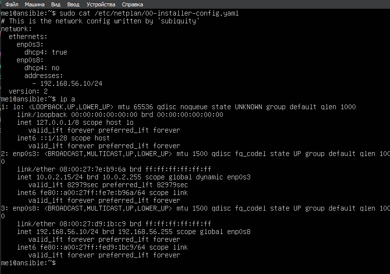
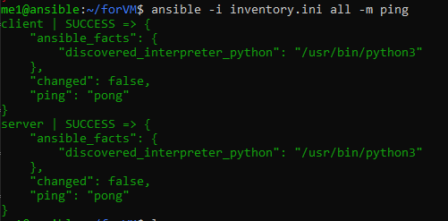
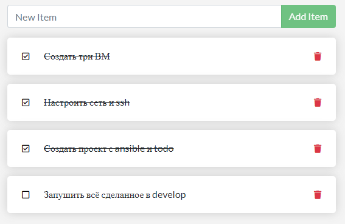

# Отчёт по работе №3: Практика Ansible

## Подготовка ВМ
1. Как и в прошлых работах создаём 3 ВМ для работы.
2. Как и в прошлых работах меняем на них hostname и user для удобства.
3. Меняем настройки сетевых адаптеров: 
- на каждой машине оставляем **NAT** для выхода в сеть
- на каждой машине добавляем **Host-Only** адаптер
4. Через `netplan` задаём новые статические IP-адреса с одной подсетью для **Host-Only** адаптеров. По итогу имеем:
- Машина A: `me1@192.168.56.10` - хост с **Ansible**
- Машина B: `me2@192.168.56.11` - сервер для **MySQL**
- Машина C: `me3@192.168.56.12` - клиент с **ToDo**
Пример настроенной сети с машины A:



5. После настройки сети устанавливаем между машинами **SSH-соединение**:
```shell
ssh-keygen -t ed25519 -C "ansible"
ssh-copy-id -i ~/.ssh/id_ed25519.pub me2@192.168.56.11
ssh-copy-id -i ~/.ssh/id_ed25519.pub me3@192.168.56.12
```
6. Проверяем **SSH-соединение** c хоста. Теперь можно установить ansible:
```shell
sudo apt update
sudo apt install ansible -y
```

## Настройка Ansible
1. Возьмём стандартную и рекомендуемую Ansible-структуру. В корневой папке проекта будет `ini` файл вместе с плейбуком и папка с ролями. Плейбук в свою очередь вызывает роли. В каждой роли (**todo** и **mysql**) будет свой `yml` файл с задачами (в папке **tasks**). Для удобства создаём все необходимые файлы локально, а затем копируем их через `scp` на хост с **Ansible**. *Папка проекта находится в репозитории под названием /forVM*. <br><br>

Структура проекта имеет вид:
```shell
forVM/
├── inventory.ini          # инвентори-файл с IP/хостами
├── playbook.yml           # основной плейбук, вызывает роли
└── roles/
    ├── mysql/
    │   └── tasks/
    │       └── main.yml   # задачи для установки и запуска MySQL
    └── todo/
        └── tasks/
            └── main.yml   # задачи для todo-приложения
```
<br><br>

2. Определяем в плейбуке роли (**todo** и **mysql**) и создаём **tasks** для каждой из них. <br>
Задачи включают в себя установку необходимых зависимостей и запуск образов с выставленными env-переменными: <br><br>

- **MySQL**:
```shell
- name: Install pip for Python3
  apt:
    name: python3-pip
    state: present
    update_cache: true

- name: Install Docker Python module
  pip:
    name: docker
    executable: pip3

- name: Install Docker
  apt:
    name: docker.io
    state: present
    update_cache: true

- name: Start MySQL container
  docker_container:
    name: mysql
    image: mysql:5.7
    state: started
    restart_policy: always
    ports:
      - "3306:3306"
    env:
      MYSQL_ROOT_PASSWORD: password
      MYSQL_DATABASE: todos
```

<br><br>

- **ToDo**:
```shell
- name: Install pip for Python3
  apt:
    name: python3-pip
    state: present
    update_cache: true

- name: Install Docker Python module
  pip:
    name: docker
    executable: pip3

- name: Install Docker
  apt:
    name: docker.io
    state: present
    update_cache: true

- name: Download Docker-image of todo-app
  docker_image:
    name: antonaleks/101-todo-app
    tag: latest
    source: pull

- name: Start todo-app container
  docker_container:
    name: todo
    image: antonaleks/101-todo-app:latest
    state: started
    restart_policy: always
    ports:
      - "3000:80"
    env:
      DB_HOST: 192.168.56.11
      DB_USER: root
      DB_PASSWORD: password
      DB_NAME: todos
```

<br><br>

3. Пересылаем папку на машину А:
```shell
scp -r "/c/Users/user/Documents/Education/Clouds/CloudPractice/forVM" me1@192.168.56.10:/home/me1/
```
4. Пробуем пропинговать машины B и C. Получаем в ответ `pong`, значит все настроено верно:



## Тестирование и результаты

1. Запускаем **playbook** на машине A. Во время установки всех файлов не должно быть ошибок.
2. Перейдем к проверке **ToDo** приложения, перейдя по адресу: http://192.168.56.12:3000/



Представленные скриншоты подтверждают работоспособность системы.
Все необходимые файлы приложены в репозитории.